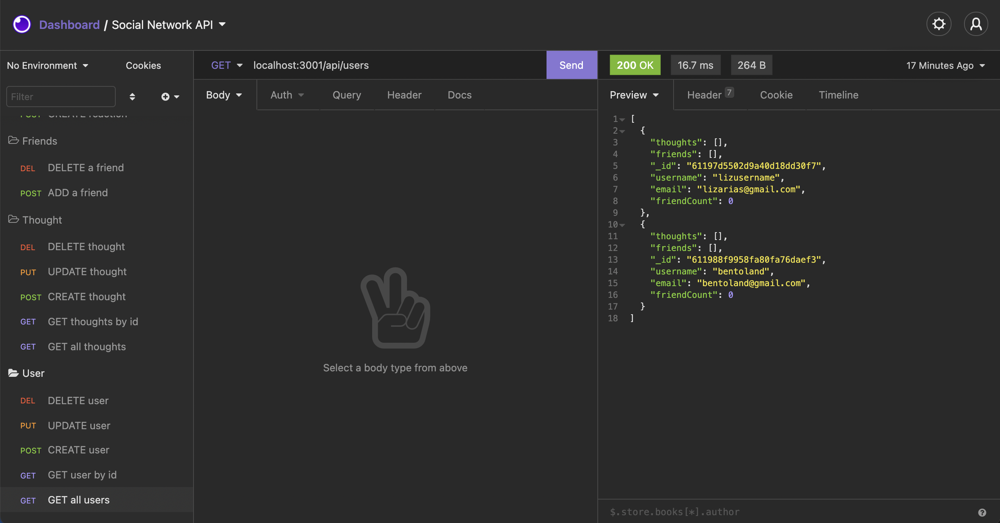

# Social Network API

## Description
An API for a social network web application where users can share their thoughts, react to friends’ thoughts, and create a friend list.

## Table of Contents

* [Installation](#installation)
* [License](#license)
* [Questions](#questions)
* [Walkthrough video](#walkthrough-video)

## Installation 
The user needs to have Node.js installed. Clone the repo, run `npm i` for the dependencies. To start the application, run: `npm start` and you can test the Application API routes with [Insomnia Core](https://insomnia.rest).

## License

## Questions
IIf you have any questions about this project, send me an email at lizethariasc14@gmail.com or contact me through my [GitHub](https://github.com/lizariasc).

## Walkthrough video
You can see the functionality of this application [here](https://drive.google.com/file/d/1xVUjU7YydzQ7PwZWw7exP-QWo3hoA5eE/view)().